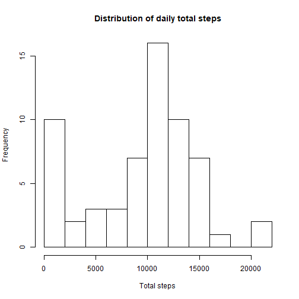
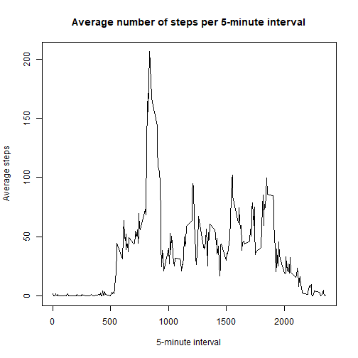
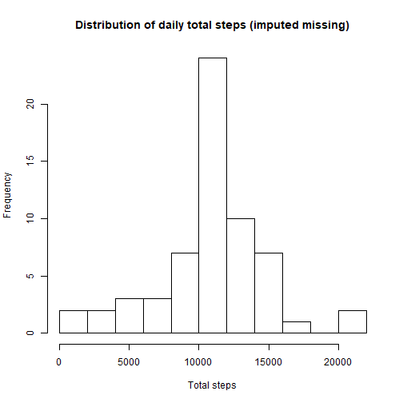
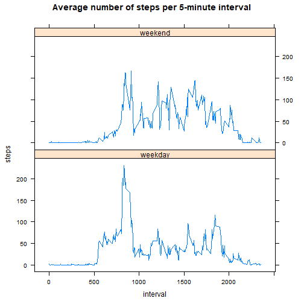

##Defining global settings


```r
knitr::opts_chunk$set(echo = TRUE)
```

##Loading and preprocessing the data

Load the required raw data and convert the date field to date format and the interval field to factor


```r
df <- read.csv("activity.csv")
df$date <- as.Date(df$date, "%Y-%m-%d")
df$interval <- as.factor(df$interval)
```

##What is mean total number of steps taken per day?

Calculate the total number of steps taken per day


```r
daytotal <- tapply(df$steps, df$date, sum, na.rm = TRUE)
```

Make a histogram of the total number of steps taken each day


```r
hist(daytotal, main = "Distribution of daily total steps", xlab = "Total steps", breaks = 10)
```



Calculate and report the mean and median of the total number of steps taken per day


```r
paste("Mean:",round(mean(daytotal, na.rm = TRUE), digits = 1), "| Median:", round(median(daytotal, na.rm = TRUE), digits = 1), sep = " ")
```

```
## [1] "Mean: 9354.2 | Median: 10395"
```

##What is the average daily activity pattern?

Make a time series plot of the 5-minute interval and the average number of steps taken, averaged across all days


```r
timetotal <- tapply(X = df$steps, INDEX = df$interval, FUN = mean, na.rm = TRUE)
plot(timetotal ~ names(timetotal), type = "l", main = "Average number of steps per 5-minute interval", xlab = "5-minute interval", ylab = "Average steps")
```



Which 5-minute interval, on average across all the days in the dataset, contains the maximum number of steps?


```r
paste("Most active interval: ", names(timetotal[timetotal == max(timetotal)]), " [", round(max(timetotal), digits = 0), " steps]", sep = "")
```

```
## [1] "Most active interval: 835 [206 steps]"
```

##Imputing missing values

Calculate and report the total number of missing values in the dataset


```r
paste("Number of missing values:", sum(1-complete.cases(df)), sep = " ")
```

```
## [1] "Number of missing values: 2304"
```

Devise a strategy for filling in all of the missing values in the dataset and create a new dataset that is equal to the original dataset but with the missing data filled in.


```r
for (i in 1:dim(df)[1]) {
        if (is.na(df$steps[i])) {
                j = as.character(df$interval[i])
                df$stepsadjusted[i] <- timetotal[j]
        } else {
                df$stepsadjusted[i] <- df$steps[i]
        }
}
```

Make a histogram of the total number of steps taken each day and Calculate and report the mean and median total number of steps taken per day. Do these values differ from the estimates from the first part of the assignment? What is the impact of imputing missing data on the estimates of the total daily number of steps?


```r
adjusteddaytotal <- tapply(df$stepsadjusted, df$date, sum, na.rm = TRUE)
hist(adjusteddaytotal, main = "Distribution of daily total steps (imputed missing)", xlab = "Total steps", breaks = 10)
```




```r
paste("Mean:", round(mean(adjusteddaytotal, na.rm = TRUE), digits = 1), "| Median:", round(median(adjusteddaytotal, na.rm = TRUE), digits = 1), sep = " ")
```

```
## [1] "Mean: 10766.2 | Median: 10766.2"
```


```r
paste("Mean difference:", round(mean(adjusteddaytotal, na.rm = TRUE)-mean(daytotal, na.rm = TRUE), digits = 1), "| Median difference:", round(median(adjusteddaytotal, na.rm = TRUE)-median(daytotal, na.rm = TRUE), digits = 1), sep = " ")
```

```
## [1] "Mean difference: 1412 | Median difference: 371.2"
```

##Are there differences in activity patterns between weekdays and weekends?

Create a new factor variable in the dataset with two levels - "weekday" and "weekend" indicating whether a given date is a weekday or weekend day.


```r
df$weekday <- weekdays(df$date)
df$daytype[df$weekday %in% c("Saturday","Sunday")] <- "weekend"
df$daytype[!(df$weekday %in% c("Saturday","Sunday"))] <- "weekday"
df$weekday <- NULL
df$daytype <- as.factor(df$daytype)
```

Make a panel plot containing a time series plot of the 5-minute interval and the average number of steps taken, averaged across all weekday days or weekend days


```r
weekdaytimetotal <- tapply(df$stepsadjusted[df$daytype == "weekday"], df$interval[df$daytype == "weekday"], mean, na.rm = TRUE)
weekendtimetotal <- tapply(df$stepsadjusted[df$daytype == "weekend"], df$interval[df$daytype == "weekend"], mean, na.rm = TRUE)

dfwd <- data.frame("weekday", as.numeric(names(weekdaytimetotal)), unname(weekdaytimetotal))
names(dfwd) <- c("daytype","interval","steps")
dfwe <- data.frame("weekend", as.numeric(names(weekendtimetotal)), unname(weekendtimetotal))
names(dfwe) <- c("daytype","interval","steps")

df2 <- rbind(dfwd, dfwe)

if("lattice" %in% rownames(installed.packages()) == FALSE) {
        install.packages("lattice")
}
library(lattice)

xyplot(steps ~ interval | daytype, data = df2, type = "l", layout = c(1,2), main = "Average number of steps per 5-minute interval")
```


